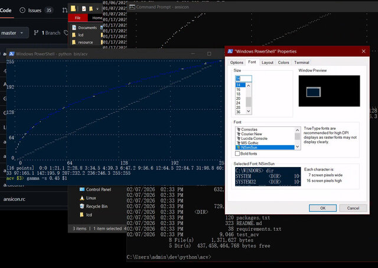
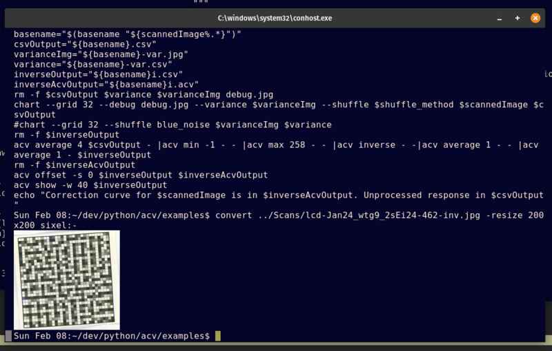

# Digital Negative Tools

This is a collection of tools for manipulating digital negatives and Photoshop curve files. My use case is to create linearization curves for use with a monochrome LCD that I use in my 4x5 enlarger to make black and white prints.

## Features
- View Adobe Curve (ACV), pencil curve (AMP) and CSV files from the command line
- Generate and read calibration charts for linearization. You can choose the number of patches and have multiple randomly shuffled patches per value to eliminate the effects of uneven illumination.
- Read printed charts and create linearization curves using manipulation primitives. e.g.
    `acv average 4 response.csv - |acv min -1 - - |acv max 258 - - |acv inverse - correction.acv`
- Apply curves to images

## Tools
- `acv` - Adobe Curve (ACV), pencil curve (AMP) and CSV file viewer and manipulator
- `chart` - Generate and read calibration charts for linearization
- `linearize` - Create linearization curves from calibration data
- `plot` - Visualize curves using gnuplot
- `apply` - Apply curves to images

## Screenshots




## Installation
### Windows 7

I have tried `acv` on Windows 7 but I had to add a monospaced font with braille characters and [ansicon](https://github.com/adoxa/ansicon) for ANSI color codes. The OpenCV python module used by chart didn't compile for me and I didn't try to fix it.

### Windows 10+

On Windows 10+ I recommend running it under the Windows Subsystem for Linux (WSL).

 - Install Windows Terminal from [here]( https://learn.microsoft.com/en-us/windows/terminal/install)
 - Add  the WSL component from the Add/Remove Windows Features dialog.
 - Install an Ubuntu distribution
```cmd
 wsl --list --online
 wsl --install -d Ubuntu-24.04
```
 - Launch Ubuntu from the Start menu
 - Open a new Ubuntu WSL terminal window
 - Install the chart tool dependencies
```bash
sudo apt update
sudo apt install python3-opencv imagemagick ffmpeg
```
 - Clone the DN-Tools repo
```bash
git clone https://github.com/ThreeSmallishMagi/dn-tools.git
```

### Linux
```bash
sudo apt update
sudo apt install xterm imagemagick ffmpeg
git clone https://github.com/ThreeSmallishMagi/dn-tools.git
```
If you want to install locally, install the python dependencies in a virtual environment:
```bash
cd dn-tools
python3 -m venv dn-tools_env
source dn-tools_env/bin/activate
pip install opencv-python
```
Otherwise install the python dependencies and tools system wide:
```bash 
cd dn-tools
sudo apt install python3-opencv
make install
```
## Usage

### acv
```
Manipulate Photoshop ACV curve files and pencil curve AMP files.

Options:
  -s, --select    Choose best 16 points (Photoshop's limit)
  -p, --preserve  Preserve x-values from first input

File formats:
  .acv   Photoshop curve files
  .amp   8-bit pencil curves (256 bytes)
  .csv   Real values with no clipping
  '%'    Display curve on screen (can be omitted)
  '-'    Read from stdin or write to stdout

Usage:
  acv offset <offset> <input> <output>
            Add an offset to a curve’s output values.
  acv max <new x=255 value> <input> <output>
            Change the contrast of a curve. The parameter is the new output
            value for an input of 255. Input 0's value will not change
  acv min <new x=0 value> <input> <output>
            Change the offset of a curve so that the x=0 has the given output.
  acv contrast <factor> <input> <output>
            Change the contrast of a curve pivoting around x=128.
  acv gamma <gamma> <input> <output>
            Apply a gamma adjustment to a curve.
  acv linear <error> <input> <output_model>
            Fit a straight line to curve points error away from 0/255.
  acv compose <curve1> <curve2> <output>
            Compose two curves (apply one after the other) Returns curve2 ∘ curve1.
  acv diff <curve1> <curve2> <output>
            Calculate 128 + curve1 - curve2.
  acv error <curve1> <curve2>
            print the max error between two curves ( output is not a curve )
  acv at <x> <curve>
            print the output value for a given input
  acv divide <original> <divider> <output residual>
            Divide original by divider by composing with inverse(divider)
            so that compose(divider, result) == original
            i.e.  r = d⁻¹ ∘ o   d ∘ r == o
  acv decompose <gamma> <input> <output_model>
            Model input as a gamma curve (usually 2.2) composed with a linear curve.
            i.e. output = g22 ∘ linear
  acv adjust <curve1> <curve2> <output>
            Combine two curves by adding curve2's deviation from identity.
  acv inverse <input> <output>
            Invert a curve. Flip it about the line y=x.
  acv smooth <points> <input> <output>
            Smooth a curve by fitting a spline with <points>points.
  acv average <span> <input> <output>
            Smooth a curve by averaging points within <span> of x.
  acv identity <output>
            Output an identity curve.
  acv show <curve> [<reference>]
            Display curve and optional reference curve.

```

### Chart

```
NxN grayscale ramp chart generator + reader.

Modes:
1) Generate a printable NxN ramp chart (8-bit grayscale image).
2) Read a photographed/scan grayscale NxN ramp grid and emit CSV points.

Output CSV columns: channel,x,y
- channel is always 0
- x is the intended (printed) ramp level: 0..255 across 100 patches (row-major)
- y is the measured level, normalized so the darkest measured patch is 0 and the lightest is 255

Dependencies: opencv-python, numpy

usage: chart [-h] [--generate OUT_IMAGE] [--grid GRID] [--invert-chart]
             [--shuffle SHUFFLE] [--size SIZE] [--debug DEBUG]
             [--variance VARIANCE] [--cell CELL] [--margin MARGIN]
             [--line LINE] [--border BORDER]
             [image] [out_csv]

positional arguments:
  image                 Input photo/scan containing the NxN ramp grid (reader
                        mode)
  out_csv               Output CSV path (reader mode)

options:
  -h, --help            show this help message and exit
  --generate OUT_IMAGE  Generate a printable ramp chart image and exit
  --grid GRID           Chart: size for a grid x grid chart (default 32)
  --invert-chart        Chart: invert patch levels
  --shuffle SHUFFLE     Chart: shuffle methods: none, blue_noise, gcd,
                        hilbert, split, shuffle, maximize_closest (default
                        blue_noise)
  --size SIZE           Reader: warp canvas size (pixels), default 1000
  --debug DEBUG         Reader: optional path to save the warped grayscale
                        image
  --variance VARIANCE   Reader: optional path to save a variance chart
  --cell CELL           Chart: cell size in pixels (default 40)
  --margin MARGIN       Chart: outer margin in pixels (default 80)
  --line LINE           Chart: internal grid line thickness (default 1)
  --border BORDER       Chart: outer border thickness (default 10)
```


### Basic Workflow and Tutorial
1. Open a new terminal window ready to run the dn-tools scripts. If you installed system wide you don't need to activate the virtual environment:
```bash
cd ~/dn-tools
. bin/env.sh
```
1. Generate a calibration chart using `chart`
```bash
chart --generate testchart.tif
```
2. Print/expose the chart. For evaluation I have included images/LcdWarmtoneGlossyInverted.jpg
3. Create linearization curves with `linearize` This is just a thin wrapper that stores my workflow.  Make your own for your needs.
```bash
linearize images/LcdWarmtoneGlossyInverted.jpg
```
4. Visualize curves using `plot` or `acv show`.
```bash
plot LcdWarmtoneGlossyInverted.csv # The measured workflow/paper response
acv show LcdWarmtoneGlossyInvertedi.acv # the inverse of the above
```
5. Apply curves to images with `apply`
```bash
apply LcdWarmtoneGlossyInvertedi.acv testchart.tif testchart_corrected.tif
```
In theory, if you printed testchart_corrected.tif, the result should be a linear black to white ramp, but it never works out that way.

## Todo

- Add a tool to expose images on a monochrome LCD
- Improve multi-channel curve support: I don't print multi-color negatives, so not a priority for me. `acv` will preserve multi-channel info in acv, amp and csv files but tool behaviour and limitations might make it useless for your workflow without changes.
- Add support for .cube format: I don't have a use for this, but it should be easy to add.
- An html javascript gui frontend: nice for curve tweaking perhaps. For now you'll have to write out a csv file and edit it with a text editor.
- Make `chart` make and read charts in the format of other linearization tools. ( e.g. chartthrob or Easy Digital Negatives)

## Bugs

You should be aware of the limitations of the file formats: acv has only 16 control points and truncates out of range values. Amp allows 256 integer values, and truncates out of range values. CSV allows multiple fractional values and does not truncate.  I have seen ugly acv files when trying to make an acv curve directly from noisy data.
Report bugs at [https://github.com/ThreeSmallishMagi/dn-tools/issues](https://github.com/ThreeSmallishMagi/dn-tools/issues)

## License

GPL v3.0

