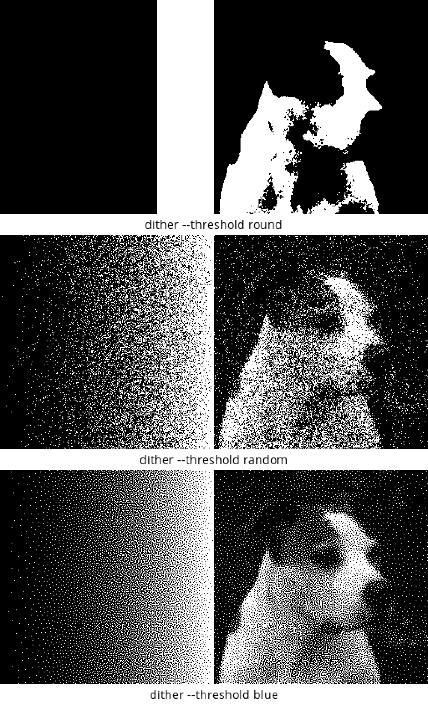
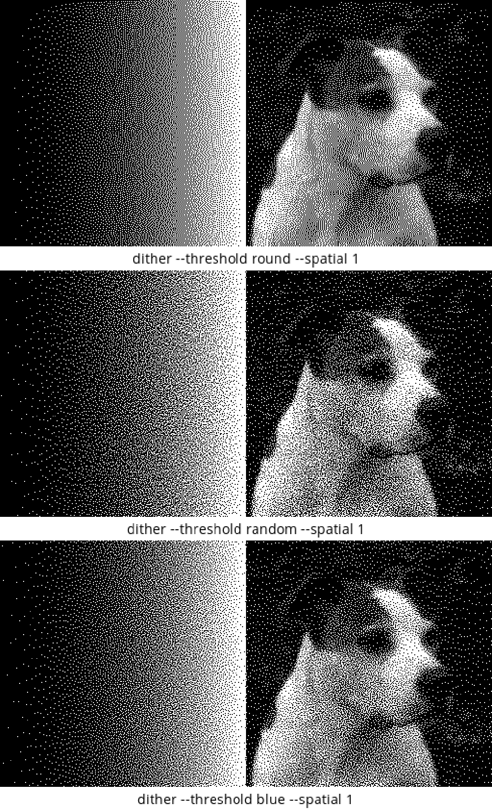
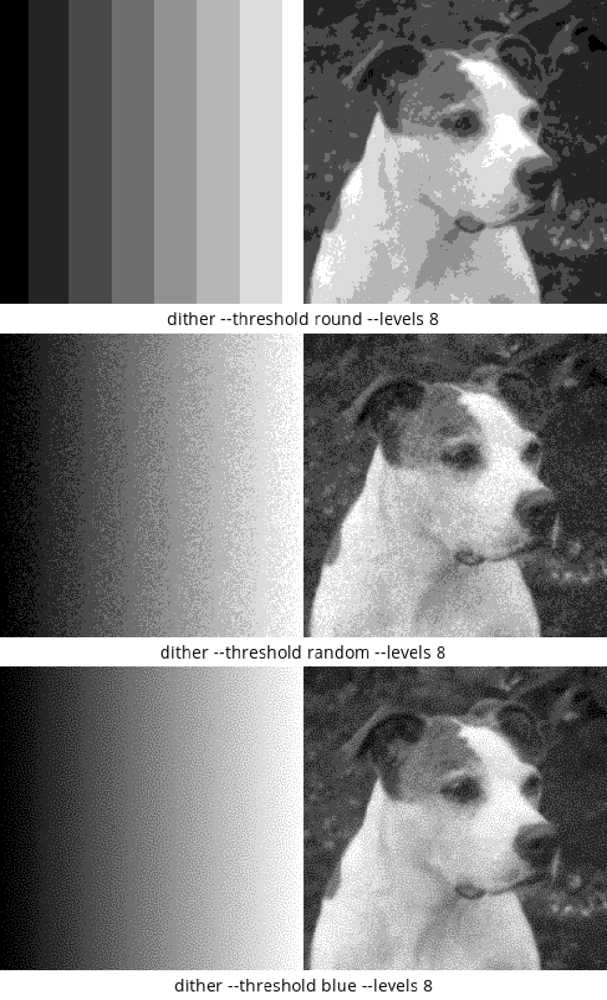
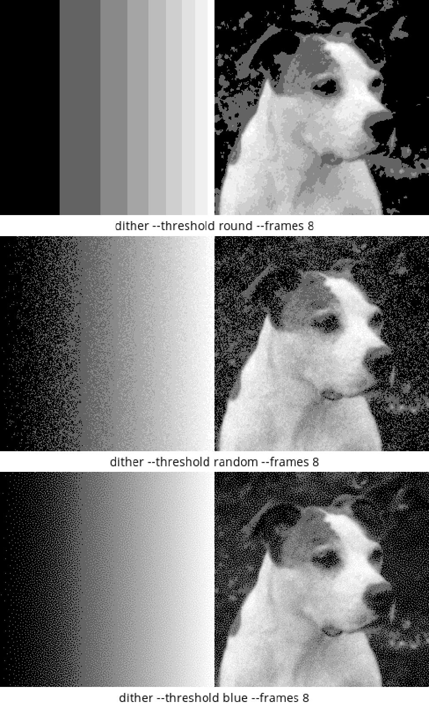

# dither

Start by running "source aliases"

A command-line image dithering tool. All quantization happens in linear light, with the
sRGB curve applied only at the encode and decode boundaries, so the dot density
of the output averages back to the tone of the input. Supports multi-level
output, blue-noise masks, and averaging over several dithered frames.

## Synopsis

```
dither <image> [options]
```

The defaults — round to nearest, full Floyd-Steinberg, two levels — need no
options:

```sh
dither photo.jpg --out out.png
```
## Examples
**examples.png** - Three threshold modes without diffusion:


**examples_spatial.png** - Same thresholds with full Floyd-Steinberg diffusion:


**examples_levels.png** - 8-level output comparison:


**examples_frames.png** - 8-frame averaging comparison:


## How a dither is specified

A dither is two independent choices: how each pixel picks a level
(`--threshold`), and how much of the leftover error is pushed onto its
neighbours (`--spatial`).

`round`
:   Deterministic round-to-nearest level. The default.

`random`
:   Stochastic threshold. Fast and grainy on its own; mixed with diffusion it
    breaks up Floyd-Steinberg's repeating patterns.

`blue`
:   Void-and-cluster blue-noise mask. Best perceptual quality, especially at low
    level counts and for print.

`--spatial` scales Floyd-Steinberg error diffusion from `1` (full) down to `0`
(none). Naming a `--threshold` drops it to `0`, on the grounds that a threshold
you picked deliberately is usually one you want to see on its own. Pass
`--spatial` explicitly, on either side of `--threshold`, to combine the two:
`--threshold blue --spatial 0.5` is blue noise with half-strength diffusion.

## Options

`--threshold <name>`
:   How each pixel picks its level: `round`, `random`, or `blue`. Default
    `round`.

`--spatial <frac>`
:   Fraction of each pixel's quantization residual diffused to its neighbours.
    `1` is full Floyd-Steinberg, `0` none, in between damps the diffusion and
    softens FS worming. Defaults to `1`, or to `0` when `--threshold` is given;
    an explicit value always wins.

`--out <path>`
:   Output file path. Default `dither.png`.

`--levels <n>`
:   Number of output tones, 2 to 256. Default `2` (black and white). More levels
    reduce visible dithering but need a display or printer that can reproduce
    the intermediate tones.

`--level-spacing <mode>`
:   Where those tones sit. `srgb` (default) spaces them evenly in pixel value —
    3 levels are 0/128/255 — putting the middle level at perceptual half and
    keeping shadow noise down. `linear` spaces them evenly in linear light, so 3
    levels are 0/188/255. No effect at `--levels 2` or with `--linear`.

`--frames <n>`
:   Dither *n* independent frames and average them; for `blue`, each frame uses
    a random shift of the same mask. Error withheld by `--spatial` is not lost
    across frames — it stays in the pixel's budget and is paid back later, so
    the average still converges on the target tone.

`--save-frames`
:   Also write each frame beside the average, as `<stem>-N.png`.

`--linear`
:   Treat pixel values as raw linear light, skipping the sRGB conversion that
    normally wraps the dither.

`--seed <n>`
:   Random seed, for reproducible masks and stochastic thresholds. Default `42`.

`--debug-pixel <r,c>`
:   Print the per-frame `ideal`/`display`/`displayed` trace for one pixel to
    stderr.

`--help`, `-h`
:   Show the built-in option summary.

## Blue-noise mask options

`--mask-size <WxH>`
:   Build a WxH tile and repeat it over the image. Defaults to the image size
    capped at 256×256, since build time grows with area; larger sizes are
    honoured when asked for. Keep the tile at least 4× sigma to avoid visible
    repetition.

`--mask-sigma <val>`
:   Kernel radius in pixels — how far dots repel each other. Default `1.8`; try
    `1.0`–`4.0` depending on output resolution.

`--mask-in <path>`
:   Use this image as the mask instead of building one; read as raw grayscale
    and tiled like a generated mask. The mask-building options are then
    ignored.

`--mask-out <path>`
:   Write the mask in use to this path, for inspection or for feeding back in
    through `--mask-in`.

`--mask-eps <val>`
:   Gaussian kernel weight cutoff. Default `1e-4`; reducing it improves quality
    slightly at the cost of speed.

`--mask-radius <mul>`
:   Kernel half-width in sigma units. Default `6.0`, which is inert — `--mask-eps`
    prunes the kernel first, at about 4.3 sigma — so this only bites below that.

## Examples

Four-level blue dither, tiling a 128×128 mask for speed:

```sh
dither photo.jpg --threshold blue --levels 4 --mask-size 128x128 --out out.png
```

Smooth averaged result from 30 frames:

```sh
dither photo.jpg --frames 30 --out out.png
```

Blue noise with half-strength error diffusion, keeping the mask:

```sh
dither photo.jpg --threshold blue --spatial 0.5 --mask-out mask.png --out out.png
```

## Build

Requires OpenCV 4.x and a C++17 compiler. Dependencies are listed in
`apt-packages.txt` (system) and `requirements.txt` (Python, for the verification
tools). `install_deps` handles both:

```sh
source aliases
install_deps          # apt, then the dither_env virtualenv
build                 # cmake configure + build, then show this manual
```

`install_deps` leaves `dither_env/bin` on `PATH`, which is what the Python tools
need to find their interpreter. The virtualenv is separate because Ubuntu 24.04
marks its system Python externally managed (PEP 668); `dither_env` is already in
`.gitignore`.

To do it by hand, or on macOS where `install_deps` bows out:

```sh
sudo apt install $(cat apt-packages.txt)   # Ubuntu 22.04 / 24.04
python3 -m venv dither_env
dither_env/bin/pip install -r requirements.txt
cmake -B build && cmake --build build
```

The default build type is Release; configure with `-DCMAKE_BUILD_TYPE=Debug` for
a debug build. Nothing in the C++ build needs the virtualenv — skip it if you
only want the `dither` binary.

## Tools

These sit at the repo root. The Python ones find their interpreter through
`#!/usr/bin/env python3` and shell out to each other, so the virtualenv has to be
on `PATH` rather than invoked as `dither_env/bin/python`. `install_deps` does
that for the current shell; otherwise:

```sh
export PATH="$PWD/dither_env/bin:$PATH"
```

Without it `coltest` reports `COLSTATS PARSE FAIL` on every row, which means
`cv2` is missing, not that the dither is broken.

`./coltest`
:   Runs a matrix of `dither` invocations against `examples/ramp_256x256.png`
    and checks each output for density preservation.

`./colstats <image>`
:   Per-column density check against a reference: column means in linear light,
    z-scored against counting noise.

`./budgettest`
:   Verifies the multi-frame invariant — with `--spatial 0`, the levels
    displayed for a pixel sum exactly to its budget.

`gnuplot colplot`
:   Plots `colstats --csv` output as sixels.

`source aliases`
:   Shell helpers. `install_deps` installs dependencies, `build` configures and
    builds, `deploy` copies the git-tracked files to the public repo.
    `analyse out.png` shows the image, a scaled difference
    against the reference, and the colstats plot side by side; `test_dither
    <args>` dithers the ramp and analyses it in one step; `run_suite` and
    `gallery` sweep that across thresholds. `icat`, `rampdiff`, `isquash`,
    `iaverage`, `histo`, `icrop`, and `dim` inspect images directly.

The `aliases` helpers draw inline images and need a sixel-capable terminal
(foot, WezTerm, xterm `-ti vt340`, mlterm).

## temporaldither

A standalone simulator (`temporaldither.cpp`, no OpenCV dependency) showing how
temporal dithering approximates an intermediate brightness by alternating
between adjacent levels across frames. Build with
`cmake --build build --target temporaldither`.

## License

GPL-3.0-or-later — see [LICENSE](LICENSE).

This program is free software: you can redistribute it and/or modify it under
the terms of the GNU General Public License as published by the Free Software
Foundation, either version 3 of the License, or (at your option) any later
version. It is distributed in the hope that it will be useful, but WITHOUT ANY
WARRANTY; without even the implied warranty of MERCHANTABILITY or FITNESS FOR A
PARTICULAR PURPOSE. See the GNU General Public License for more details.
